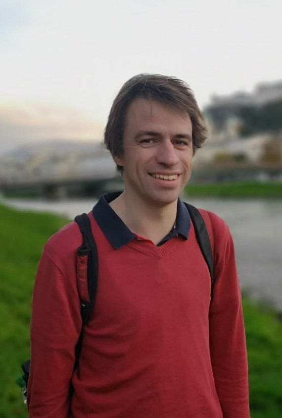

---

layout: page
title: "About"

---

Hello! My name is Tobias Kühn. I'm a postdoctoral researcher currently working at the interface of neuroscience and theoretical physics.

My current position is at the [Institut de la Vision](https://www.institut-vision.org/en/) in Paris, France, where I work with [Ulisse Ferrari](https://scholar.google.it/citations?user=89XheA0AAAAJ&hl=it) on the analysis of electrophysiological data from the retina with tools from statistical physics. 

Previously I have carried out postdoctoral work on field theory and soft matter with [Frédéric van Wijland](https://scholar.google.fr/citations?user=tTppDosAAAAJ&hl=en) at the [Laboratoire Matière et Systèmes Complexes](http://www.msc.univ-paris-diderot.fr) of Université de Paris, and with [Remi Monasson](https://scholar.google.com/citations?user=J6LkBeUAAAAJ&hl=fr) on positional information encoded in disordered systems at the [Laboratoire de Physique](https://www.lpens.ens.psl.eu/?lang=en) of École Normale Supérieure.

I did my PhD with [Moritz Helias](https://scholar.google.de/citations?user=NZQ_gSAAAAAJ&hl=en) at the [Institut of Computational and Systems Neuroscience](https://www.fz-juelich.de/de/inm/inm-6) of the [Forschungszentrum Jülich](https://www.fz-juelich.de/de) in Germany, working on the adaptation of techniques from statistical physics to neuroscience, as well as their further development.

I am fascinated by how theoretical physics connects seemingly desparate phenomena and thereby deepens their understanding. My works on diagrammatics of non-Gaussian theories, for example, help to reveal the common grounds of objects as diverse as simple liquids and neural networks. These connections to the real world mean in particular that theoretical physics is not only beautiful, but - lucky me - might also be useful in the real world!

